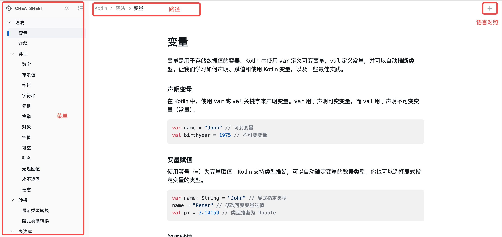

# Cheatsheet

Cheatsheet 是为有一定**编程基础**的开发人员提供的速查手册，一般以简明、易读的格式列出常用的用法、代码片段或其他技术信息。它通常是给开发者用来快速查找某个语言、框架或工具的关键功能和用法的便利资源。

- 简洁明了：只包含最核心、最常用的内容，避免冗长的解释。
- 格式清晰：常常以表格或分类的方式排列，方便浏览。
- 涵盖关键功能：列出常用命令、API、常见错误及解决方法等。

## 为什么

虽然所有的编程语言、框架或工具都提供了官方文档 —— 通常包含：教程、示例、API、FAQ、博客和社区等。但出于权威且全面的要求，这些文档通常存在一些局限性：

- 信息量庞大，查找速度慢：官方文档通常结构复杂、内容详尽，包括从基础概念到高级功能的全面介绍。开发者在查阅某个特定问题时，往往需要花时间浏览文档的不同部分，特别是当不确定要寻找的内容在何处时，这可能会影响效率。
- 结构过于分散：大多数官方文档的组织方式按教程、示例或 API 划分，虽然内容详尽，但这种结构有时会导致开发者在寻找信息时不得不跳转多个页面。例如，解决一个问题可能需要查看多个模块的详细说明，无法一目了然获取整体的使用概览。
- 学习路径不清晰：通常缺少针对不同经验水平的用户的分层指导，导致初学者和有经验的开发者都需要自行筛选内容，无法快速找到适合当前水平或问题的答案。初学者可能不清楚从何学起，而有经验的开发者则可能需要翻阅多处才能找到某个特定用法的细节。
- 缺乏实践经验：方文档通常以描述性为主，详细介绍每个功能或 API 的定义和用法，但很少涉及实际项目中的应用场景。文档倾向于列举简单、单一的示例，而不展示如何在复杂的项目中整合这些功能。这使得开发者在面对现实中的问题时，可能难以参考文档解决实际的挑战。

相比于理论知识，很多开发者喜欢阅读实战类的博客或图书，几乎每个程序员的书架上都有一两本名为“XX实战”的技术图书，就算你没没有，那一定看到过 Manning 出版的“in Action”系列极具特色的封面。


但是编程技术一直在不断的发展变化中，这些博客或图书很快会过时，无法及时的满足开发者的需求，甚至会给开发者带来学习障碍（混淆新旧知识）。

## 怎么办

**解决人力成本高和更新不及时问题**

依赖人力来编写博客和书籍，始终存在工作量太大，更新不及时，最终免不了文档被废弃的结局。但是在 AIGC 的时代，我们可以让 AI Agent 来帮助我们整理教程，它就是那些博客和书籍的新时代“作者“。通过提示词，可以让 AI 写出各种风格的文档或示例，并通过定时脚本，及时的让 AI 自我学习并更新文档。

**确定文档风格和面向人群**

Cheatsheet 是给有一定编程基础的开发人员提供的较好解决方案，但目前互联网上的 Cheatsheet 资料都不够全面。下面是按 "programming cheatsheet" 的 Google 搜索到前几名结果，这些大多都是针对编程语言的，缺少框架和工具方面的文档。

- [Cheatsheets by Codecademy](https://www.codecademy.com/resources/cheatsheets/all)
- [Free Programming Cheatsheets](https://github.com/EbookFoundation/free-programming-books/blob/main/more/free-programming-cheatsheets.md)
- [2768 Programming Cheat Sheets](https://cheatography.com/programming/)
- [Quick Reference](https://quickref.me/index.html)
- [Geeksforgeeks Cheatsheets – All Coding Cheat Sheets Collections](https://www.geeksforgeeks.org/geeksforgeeks-cheatsheets-all-coding-cheat-sheets/)
- https://learnxinyminutes.com/

## 设计实现

### 实现思路

1. 人工梳理 Cheatsheet 组织结构。

  ps：未来可以尝试训练 AI 来创建比迭代更新 Cheatsheet 组织结构

2. 通过爬虫爬取相应的官方文档、博客或书籍内容，这些内容作为 Cheatsheet 内容的参考文档。
3. 使用文档评价 AI 来对文档进行排序，选取匹配度和质量较高的前几名文档作为参考文献。
4. 使用 Cheatsheet AI 来对参考文献和提示词进行处理，生成对应的 Cheatshhet 内容。
5. 搭建前端网站呈现 Cheatsheet

### 文档格式

文档的存储格式采用 YAML，对比 JSON 可读性更好，并且容错率也更高。

```yaml
id: 标识
title: 标题
query: 关键词
comment: 备注说明
description: 特性描述
usage:
  - title: 用法标题
    description: 用法说明
    example: 用法示例
references:
  - title: 文档标题
    url: 文档地址
```

## 使用教程



## 未来规划

- 多 AI Agent 优化：现在通过思维链提示词模式来生成内容，但有时效果不是很好。后续考虑采用工作流模式把任务拆分成多个，非别交给不同的 AI Agent 来针对性优化处理。
- 交互体验优化：让 Cheatsheet 变得更 "Cheatsheet"。

